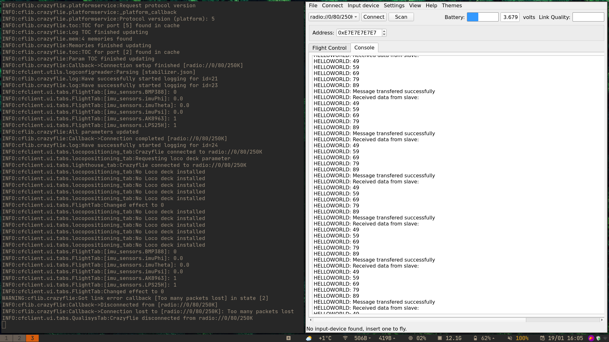
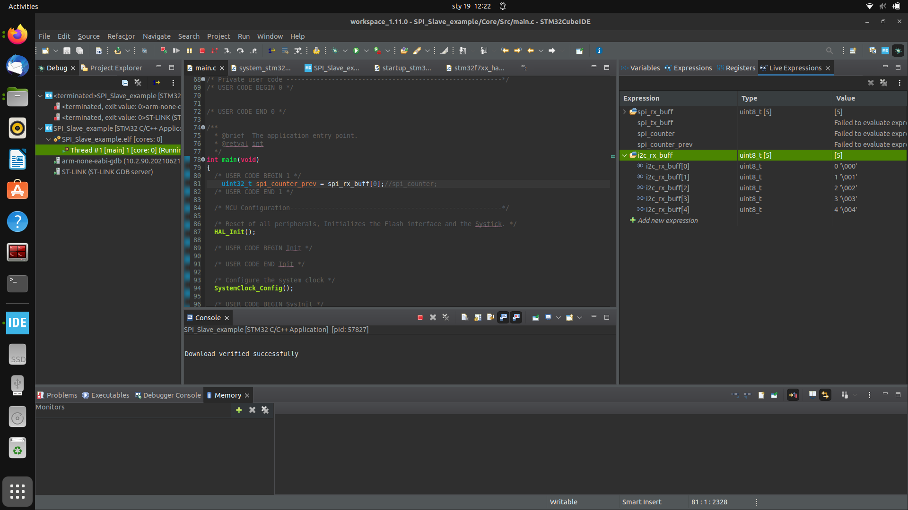
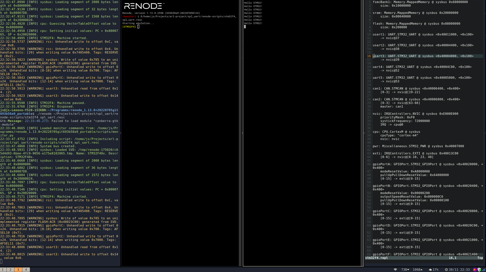

# arl-project

# Authors

* Jakub Szukała
* Filip Augustyniak
* Mikołaj Borys
* Jakub Bohonos

This repository contains source files for extending functionalities of Crazyflie
drone and Flapper Drone.

# WARNING

This is not complete instruction on how to handle Crazyflie drones. This is more
of a reminder for people familiar with the procedure and for pretty specific case.
Please use official documentation if it is Your first encounter with the
drone / build procedure.

### Setup

First clone the [crazyflie-firmware](https://github.com/bitcraze/crazyflie-firmware) repository **with all submodules**:
The commit hash that we used for testing is: d89b96226ddd4540171770a036a375c8606b4f1f

```bash
$ git clone --recursive https://github.com/bitcraze/crazyflie-firmware.git
```
Source files from this repository are used in the build process of our application,
so it is crucial to have them. Our application is built into one binary together
with FreeRTOS.

Install toolchain:

```bash
$ sudo apt-get install make gcc-arm-none-eabi
```

#### Building and flashing

The build is performed as OOT (Out Of Tree) build. This procedure needs special
setup. For Detailed project setup refer to the
[documentation](https://www.bitcraze.io/documentation/repository/crazyflie-firmware/master/userguides/app_layer/)
of OOT build from Crazyflie to familiarize Yourself with project tree structure.

When building examples from this repository, all of them are already set up in
correct way so You can immediatly go to build procedure.

First, export CRAZYFLIE\_BASE environment variable which will point to the root
of crazyflie-firmware directory. It is used by build system to compile all the
basic Crazyflie firmware (FreeRTOS, drivers etc) and then on top of it Your
application. For example:

```bash
$ export CRAZYFLIE_BASE=/path/to/your/crazyflie-firmware
```

Now You should be ready to build the application. Go to Your application's root
directory, where Makefile is stored, and run:

```bash
$ make clean # this can throw error on first build, ignore it
$ make -j12
```

Application should be compiled now. To flash it to the drone, You will need to follow
flash and build instructions from Bitcraze. Bellow is presented simple summary.

Follow these steps:
* Connect [Crazyradio](https://www.bitcraze.io/products/crazyradio-pa/)
* Run [cfclient](https://www.bitcraze.io/documentation/repository/crazyflie-clients-python/master/userguides/userguide_client/)
* Turn off the drone with a power button
* Run `make cload` from application root directory with Makefile to start flashing procedure
* You will then have 10 sec to get drone to bootloader mode
* To do that, hold the same power button for 3 sec, until blue on-board diodes start to blink
* Now, the flash procedure shold begin, it will be indicated in terminal

**When in any doubt, refer to the official Crazyflie [documentation](https://www.bitcraze.io/documentation/repository/crazyflie-firmware/master/building-and-flashing/build/)**

#### Details on building the application layer

In general, the build is pretty straight forward and well explained in the
[official instruction](https://www.bitcraze.io/documentation/repository/crazyflie-firmware/master/userguides/app_layer/).

We will need to modify it though, so it will suit the Flapper Drone.

The build of application layer will build both the RTOS and the application layer
on top of it and merge them into single binary.

Crucial files in the build process (structure of [examples/app_hello_world](https://github.com/bitcraze/crazyflie-firmware/tree/master/examples/app_hello_world)):
* app-config - overrides settings from .config file
* Kbuild - specifies what files / dirs will be included in the build process
* Makefile - it will execute main crazyflie-firmware Makefile for OOT build `include $(CRAZYFLIE_BASE)/tools/make/oot.mk` (Out Of Tree) but with custom configuration passed as
`OOT_CONFIG := $(PWD)/app-config`. Little bit strange thing about this is that this main OOT Makefile has hardcoded `alldefconfig` as a defconfig, which will build for cf2 with all options enabled. What we need to do here to build for flapper, is to override specific config options in app-config to make it suitable for flapper, for example:
    ```
    CONFIG_APP_ENABLE=y
    CONFIG_APP_PRIORITY=1
    CONFIG_APP_STACKSIZE=350
    CONFIG_PLATFORM_FLAPPER=y
    CONFIG_DECK_FORCE="bcUSD:bcLedRing:bcFlapperDeck"
    CONFIG_DECK_FLAPPER=y
    CONFIG_POWER_DISTRIBUTION_FLAPPER=y
    ```
When we perofrm build for alldefconfig after compilation we get:
```
Build for the cf2!
```

After modifying the app-config for Flapper we should get:
```
Build for the flapper!
```

### Examples

Examples can be build in usual way described above. Just enter the example
directory and run make. Remember to export environmental variable.

1. app\_hello\_world - The most basic demonstration of crazyflie application. Every 2 seconds, prints "Hello World!".
2. app\_i2c\_ardu - Demo showcasing communication with Arduino / STM32 over I2C interface, with crazyflie as master. Working properly.
3. app\_i2c\_bmp280 - Application that will communicate with BMP280 sensor over I2C. Uses I2C driver implementation from crazyflie and framework from Bosch Sensortec. Does not work properly in current iteration. Constant value is read from the bus.
4. app\_i2c\_demo - Attempt to communicate over I2C. Not working currently.
5. app\_spi\_ardu - Attempt to communicate with Arduino / STM32 over SPI with crazyflie as master. Not working currently. There is constant bit shifting at the receiver side.
6. app\_spi\_demo - Attempt to communicate with BMP280 over SPI interface. Communication would be reading and writing to registers. Currently not working. Sensor is not responding to communication attempts. On oscilloscope communication looks fine.
7. app\_toggle\_GPIO - Application that demonstrates simple toggling of GPIO. LED can be connected to that GPIO.
8. app\_uart\_demo - Successfull attempt to communicate over UART between crazyflie and Arduino.

### Working applications screens


*Working crazyflie master*


*Working STM32 slave*


*Attempt of simulating onboard Crazyflie's STM32*

### STM32\_slave

This directory contains source files that were used to perform communication with STM32 over SPI and I2C interfaces. This source code is prepared for STM32F746ZGT on the Nucleo 144 board.
```c
// set 1 to use SPI program try to communicate via I2C
#define use_spi 1
```

### spl\_uart

Source files in this directory are an attempt to simulate reduced crazyflie's
hardware in [Renode](https://github.com/renode/renode) and test the interfaces
in an isolated manner. **We discontinued this project as we decided that the
crazyflie firmware is too coupled to isolate single interface.**

Example there is an implementation of UART interface on
STM32F4 (exactly the same model as on crazyflie) with STM32F4xx\_StdPeriph\_Driver
library in exact version used in [crazyflie to handle UART](https://github.com/bitcraze/crazyflie-firmware/tree/master/src/lib/STM32F4xx_StdPeriph_Driver).

First install Renode according to instructions. Simulation environment is set
with use of *.resc* configuration file. It will use the STM32F4 platform
description file and display communication results on *UART3*. To start simulation
run:

```bash
$ ./renode /path/to/repo/arl-project/spl_uart/renode-scripts/stm32f4_spl_uart.resc
```

You should see the Renode terminal with an UART3 analyzer in which "Hello
STM32!" should be displayed.
